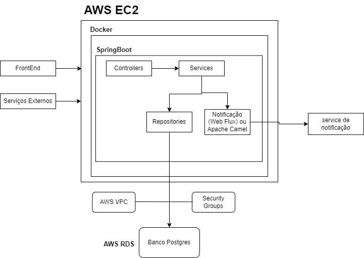
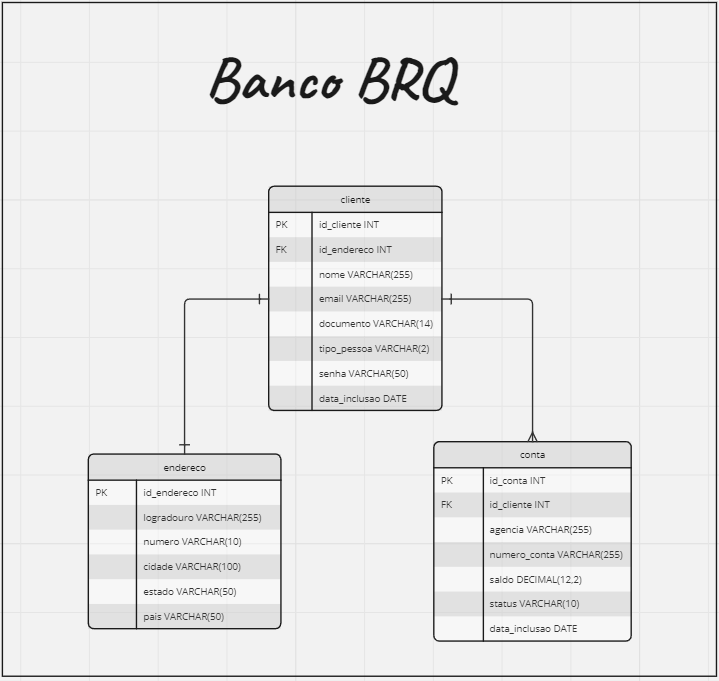

## Atualização 22/01/2024
O Free tier do AWS EC2 de 720h foi expirado e consequentemente a API e o banco (aws RDS) não estão mais ativos, para executar a API será necessário baixar localmente, instalar o postgres ou via inicializar via docker, instanciar um novo banco (banco_brq), criar as tabelas via script, inserir o cliente, conta e testar as transferências, os detalhes estão descritos abaixo.

 
 # Projeto DesafioBRQ

Este projeto foi desenvolvido utilizando as seguintes tecnologias:

- **Spring Boot:** Uma estrutura poderosa para criar aplicativos Java baseados em padrões de mola.
- **PostgreSQL:** Um sistema de gerenciamento de banco de dados relacional poderoso.
- **WebFlux:** O módulo reativo do Spring para criar aplicativos assíncronos e baseados em eventos.
- **AWS EC2:** Serviço de computação em nuvem da Amazon para hospedar o sistema.
- **AWS RDS:** Serviço de banco de dados relacional gerenciado da Amazon para hospedar o banco de dados.
- **Docker:** Plataforma que facilita a criação, implantação e execução de aplicativos em contêineres.
- **GitHub Actions:** Automatize seu fluxo de trabalho de desenvolvimento diretamente do seu repositório GitHub.

## Documentação da API

A documentação da API pode ser encontrada na coleção Postman exportada. Use o arquivo [DesafioBRQ.postman_collection.json](DesafioBRQ.postman_collection.json) para importar a coleção no Postman e explorar os endpoints disponíveis.

## Usuários de Teste

Já existem dois usuários cadastrados na base de dados para fins de teste. No entanto, sinta-se à vontade para criar novos usuários conforme necessário.

- **Usuário 1:**
    http://54.162.239.26:8080/api/clientes/documento/27389653000

- **Usuário 2:**
    http://54.162.239.26:8080/api/clientes/documento/45425664800

## Executando o Projeto

O sistema estará acessível em http://54.162.239.26:8080

Caso queira executá-lo localmente, poderá utilizar as credenciais comentadas no application.properties + banco com o nome: banco_brq + script de criação do banco de dados [banco-brq.sql](banco-brq.sql) 


## Exemplo de payloads:
```
// Incluir Clientes
POST: http://54.162.239.26:8080/api/clientes
Body:
{
    "nome": "Maria da Silva",
    "email": "maria.silva@gmail.com",
    "senha": "luva22",
    "documento": "27389653000",
    "endereco": {
        "logradouro": "rua dos patriotas",
        "numero": "1432",
        "cidade": "Sao Paulo",
        "estado": "SP",
        "pais": "Brasil"
    }
}

// Incluir Conta
POST: http://54.162.239.26:8080/api/contas
Body:
{
    "agencia": "0003",
    "numeroConta": "90200",
    "documentoCliente": "27389653000",
    "saldo": 525
}

// Transferência
POST: http://54.162.239.26:8080/api/transferencias/agencia/0003/conta/90200
Body:
{
    "agenciaDestino": "0001",
    "contaDestino": "35784",
    "valor": 50
}

// Busca por cliente pelo numero documento
GET: http://54.162.239.26:8080/api/clientes/documento/4542566800
```

## Desenho da Arquitetura do Sistema




## Desenho do Relacionamento entre tabelas do Banco de Dados


